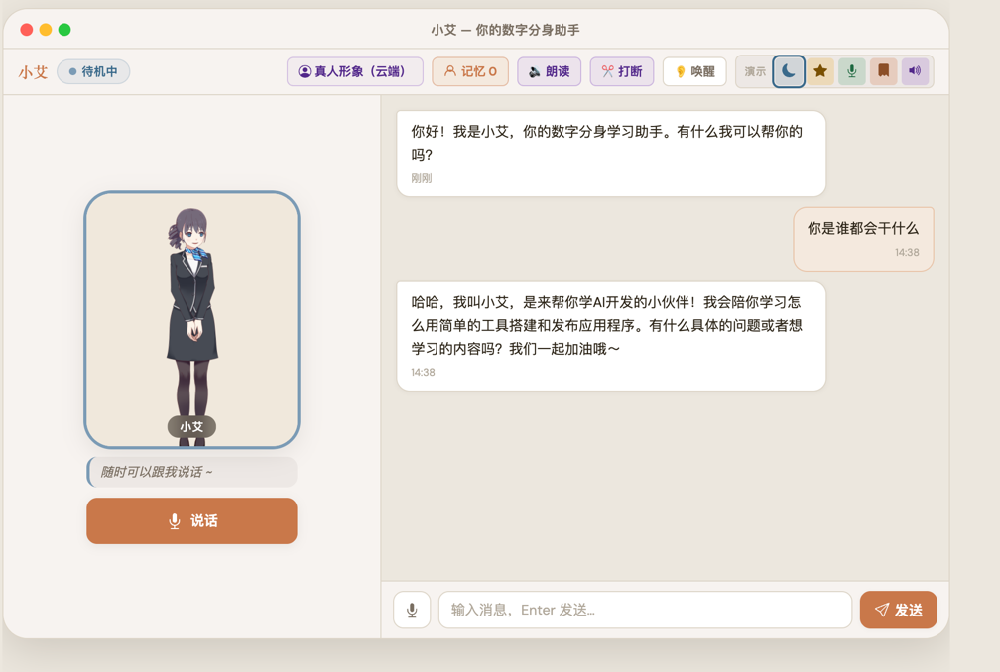

<div align="center">

# 数字分身助手 Digital Twin

一个跑在 **Apple Silicon Mac 纯本地** 的卡通数字分身助手「城北」。  
能聊天、会说话、能听懂、记得你，还支持唤醒词和语音打断。

> 🆕 **真人版「小忆」**：本仓另含一套**写实真人数字人**（云端阿里百炼）——会聊天、用龙婉女声回你、**脸还能对口型说话**。一个 API Key 跑通，详见下方 [真人形象「小忆」](#真人形象小忆realhuman-模式--已实现) 章节。




</div>

---

## 这个项目是什么？

这是「真人数字分身」课程项目的 **MVP 完整版**。它不是一个只停留在概念里的 Demo，而是一套可以在本地跑起来、一步步讲给零基础学员听的完整项目。

核心思路很简单：

> 前端负责互动体验，Node 后端统一转发能力，本地 Ollama / macOS say / 浏览器 Web Speech / SQLite 负责把能力跑起来。

每个能力都优先提供「零依赖开箱即用」方案，高质量版本作为可选升级。先跑通，再优化。

## 亮点能力

| 阶段 | 能力 | 效果 | 默认方案 |
|---|---|---|---|
| 0 | 文字对话 | 接本地 LLM，流式逐字回复 | Ollama / Gateway |
| 1 | 会说话 | 回复自动朗读，分句边播边说 | macOS `say` |
| 2 | 能听懂 | 点击麦克风，语音转文字并发送 | Web Speech API |
| 3 | 有张脸 | Live2D 卡通形象，口型随音频动 | Live2D |
| 4 | 记得你 | 长期记忆 + 用户画像 + 记忆管理页 | SQLite |
| 5 | 像真人 | 喊「城北」唤醒，说话时可打断 | 前端监听 |
| 6 | 真人形象 | **已实现**写实真人数字人 + EMO 对口型视频 | 阿里百炼（云端）|

## 快速开始

### 1. 安装依赖

```bash
npm install
```

### 2. 准备配置

```bash
cp .env.example .env
```

默认使用本地 Ollama：

```bash
ollama pull qwen2.5:7b
ollama serve
```

`.env` 保持：

```env
LLM_PROVIDER=ollama
OLLAMA_MODEL=qwen2.5:7b
```

如果暂时不想装 Ollama，也可以切到中转网关：

```env
LLM_PROVIDER=gateway
GATEWAY_BASE=https://gw.diaoye.org/v1
GATEWAY_KEY=你的_API_Key
GATEWAY_MODEL=claude-sonnet-4-5
```

### 3. 启动项目

```bash
npm start
```

打开浏览器访问：

```text
http://localhost:3000
```

## 推荐运行环境

- macOS + Apple Silicon Mac
- Node.js 18+
- Chrome / Edge（语音识别更稳定）
- Ollama（本地 LLM 推荐）
- Python 3.12（仅 Kokoro TTS / Whisper ASR 可选升级需要）

## 项目结构

```text
digital-twin/
├── server.js                         # Express 后端：LLM / TTS / ASR / 记忆 / 真人形象 / 话术库
├── memory.js                         # 记忆模块：SQLite + 关键词 / Ollama 向量检索（也供话术库语义命中）
├── realhuman/
│   └── api.js                        # 阿里百炼封装：qwen3-max / CosyVoice / 文生图 / EMO 对口型
├── public/
│   ├── index.html                    # 单页前端：聊天、形象、语音、对口型、设置、记忆面板
│   └── avatars/                      # 形象图 + 对口型视频本地缓存（gitignore）
├── docs/
│   ├── PRD.md                        # 真人版产品规范
│   ├── 高保真设计稿.html              # 关怀岛屿紫色风视觉稿
│   ├── 调研报告-数字人与TTS方案-2026.06.md
│   └── 真人形象-云端部署指南.md
├── tts_server.py                     # Kokoro TTS 可选服务
├── asr_server.py                     # Whisper ASR 服务（真人版语音输入；内置 hf 镜像 + 绕代理）
├── .env.example                      # 配置模板
└── README.md
```

本地私有数据不会提交：

```text
.env
node_modules/
data/memory.db
```

## 能力拆解

### 文字对话

前端向 Node `/api/chat` 发请求，Node 再转发给本地 Ollama 或中转网关。回复是流式输出，用户能看到文字一点点出现。

### TTS 语音合成

默认使用 macOS 自带 `say` 命令，不需要额外安装：

```env
TTS_ENABLED=true
TTS_PROVIDER=say
TTS_VOICE=Tingting
```

如果想要更自然的声音，可以启动可选 Kokoro 服务：

```bash
uv venv --python 3.12 .venv-tts
uv pip install --python .venv-tts mlx-audio "misaki[zh]" fastapi uvicorn
.venv-tts/bin/python tts_server.py
```

### ASR 语音识别

默认使用浏览器 Web Speech API：

```env
ASR_ENABLED=true
ASR_PROVIDER=webspeech
```

如果想要本地离线识别，可以启动可选 Whisper 服务：

```bash
uv venv --python 3.12 .venv-asr
uv pip install --python .venv-asr mlx-whisper fastapi uvicorn python-multipart
.venv-asr/bin/python asr_server.py
```

### 长期记忆

记忆存在本地 SQLite：

```text
data/memory.db
```

它会记录两类内容：

- 用户画像：称呼、职业、偏好等稳定信息
- 对话记忆：重要经历、需求、上下文

如果 Ollama embedding 模型可用，会优先走向量检索；否则自动降级关键词匹配。

```bash
ollama pull nomic-embed-text
```

### 唤醒词和打断

- 喊「城北」可以唤醒助手
- 城北朗读时，你开口说话可以打断它
- 这两项都优先在浏览器前端完成，不强依赖 Python 服务

```env
WAKE_WORD_ENABLED=true
WAKE_WORDS=城北
BARGE_IN_ENABLED=true
```

### 真人形象「小忆」（realhuman 模式 · 已实现）

除了本地 Live2D 卡通，本仓还实现了一套**云端写实真人数字人「小忆」**——全部能力接 **阿里百炼**，一个 `DASHSCOPE_API_KEY` 跑通：

| 能力 | 模型 / 接口 |
|---|---|
| 脑（对话） | `qwen3-max`（流式） |
| 声（语音） | `cosyvoice-v2`（龙婉 / 龙橙 / 龙华女声） |
| 脸（形象） | `wanx2.1-t2i-turbo` 文生图 |
| 脸（对口型） | `emo-detect-v1`(同步) + `emo-v1`(异步)，生成嘴型同步视频 |
| 听（语音输入） | 本地 `mlx-whisper`（大陆可用；Web Speech 在大陆连不上谷歌） |

**启用方式**（`.env`）：

```env
LLM_PROVIDER=dashscope
AVATAR_PROVIDER=realhuman
DASHSCOPE_API_KEY=sk-你的key       # 阿里百炼控制台获取，用「华北2(北京)」地域
ASR_PROVIDER=whisper               # 语音输入走本地 Whisper
```

```bash
# 语音输入：起本地 whisper（首次自动下模型，脚本内置 hf 镜像 + 绕代理）
.venv-asr/bin/python asr_server.py
# 语义命中（可选）：起 ollama，让"意思相近的话"也命中已生成的对口型视频
ollama serve && ollama pull nomic-embed-text
npm start   # 浏览器开 http://localhost:3100
```

**核心体验设计**：

- **流畅模式（默认）**：对话只播**语音 + 静态写实形象**，秒回不卡。对口型视频云端生成慢（~40s），不在对话现场做。
- **对口型话术库**：在「设置 → 对口型视频」里**预生成**常用语（开场白等），存进话术库；对话说到**相同的话**（标点/断句不同也算）就秒出口型，字幕自动同步成库里那句，保证「嘴上说的」和「屏幕显示的」一致。还有一层「语义命中」（用词不同但意思相近）**默认关闭**——nomic-embed-text 对含相同名字的中文短句相似度虚高（「你好呀小忆」和「小忆陪你慢慢来」高达 0.978），易误命中播错视频；要启用设 `SPEAK_SEMANTIC=true`（建议先换更好的中文 embedding 模型）。
- **持续对话（免手）**：AI 回完自动开麦，讲完停顿自动发送，一轮接一轮；8 秒没说话自动退出省电。设置可关。
- **本地缓存**：形象图、对口型视频都下载到本地（`public/avatars/`），重启复用、不怕 24h 临时 URL 过期、不重复烧额度；「重置形象」/「清除视频缓存」可在设置里单独管理。

> ⚠️ **EMO 接口坑**：`emo-detect-v1` 是**同步**接口（不要加 `X-DashScope-Async`，否则报 403「不支持异步调用」，容易被误判为账号未开通）；`emo-v1` 是异步，视频 URL 在 `output.results.video_url`。
> 历史参考（"真人形象本地不可行"）见 [`docs/真人形象-云端部署指南.md`](docs/真人形象-云端部署指南.md)；本实现走的是「云端按需生成 + 本地缓存 + 话术库命中」路线。

## 常见问题

### 页面能打开，但发消息没回复？

先检查 Ollama 是否启动：

```bash
ollama list
ollama serve
```

如果开着系统代理 / VPN，可能会影响 `localhost:11434`，建议先关掉再试。

### 语音按钮没反应？

请使用 Chrome 或 Edge。Safari 对 Web Speech API 支持有限。

### Live2D 形象没加载？

Live2D 资源依赖网络和 CDN。形象加载失败不影响文字对话功能。

### Whisper / Kokoro 安装失败？

确认使用 Python 3.12，不要使用系统自带 Python：

```bash
uv venv --python 3.12 .venv-asr
uv venv --python 3.12 .venv-tts
```

### 真人版对口型视频生成很慢 / 想要秒出？

对口型视频是云端 EMO 渲染，单条 ~40 秒，属正常。对话默认是「流畅模式」（只语音 + 静态形象，秒回）。想要秒出口型：在「设置 → 对口型视频」里**预生成**常用语，对话说到**相同的话**（标点/断句不同也行）就秒出。

### 想开「语义命中」（意思相近、用词不同的话也秒出）？

默认**关闭**。原因：`nomic-embed-text` 对含相同名字/关键词的中文短句相似度虚高（「你好呀小忆」和「小忆陪你慢慢来」高达 0.978，只因都含「小忆」），开了会误命中、反复播错视频。

默认只用「精确 + 归一化命中」（说相同的话、标点不同也算），可靠不误伤。

真要语义命中，先起 Ollama 并**建议换更适合中文的 embedding 模型**（如 `bge-m3`），再开开关：

```bash
ollama serve && ollama pull bge-m3
```

```env
SPEAK_SEMANTIC=true
EMBED_MODEL=bge-m3
SPEAK_MATCH_THRESHOLD=0.85
```

## 教学定位

这个项目适合用来讲：

- 一个 AI 产品如何从最小 MVP 逐步长出来
- 前端、Node 后端、本地模型服务之间如何分工
- 为什么「真人数字分身」本地不可行，而 Live2D 是更现实的教学路径
- 如何用零依赖默认方案降低学习门槛，再逐步升级质量

---

<div align="center">

**先跑起来，再一点点变强。**

</div>
